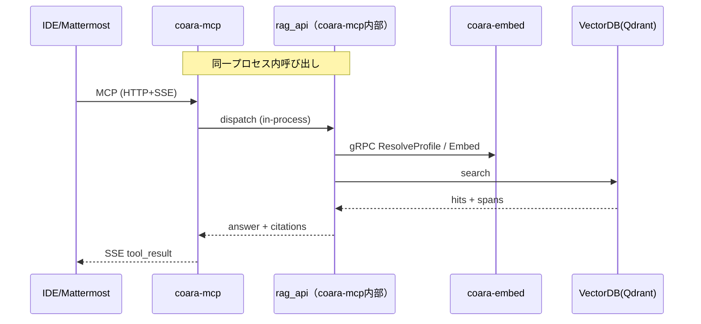
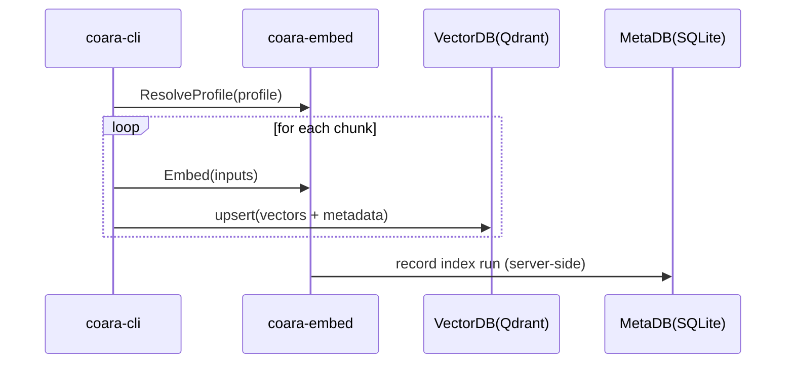
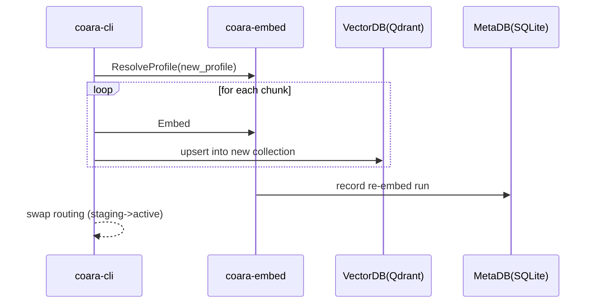

# coara（ソースコード特化RAGシステム）概要設計書

ファイル: docs/basic_design.md
版: v0.2（ドラフト）
更新日: 2026-01-27（Asia/Tokyo）

## 1. 目的

本書は、coara（ソースコード特化RAGシステム）の概要設計として、以下を定義する。

* 主要コンポーネントの責務分担と論理境界
* 技術スタック（言語・主要ライブラリ）
* リポジトリ構成（ソースコードツリー、生成物名、設定ファイル）
* 実装すべき機能一覧（要件IDとの関連付け）
* 代表フロー（インデックス、問い合わせ、Re-embed）の整合

前提仕様は次を参照する。

* docs/requirements_specification.md（v0.5）
* docs/interface_specification.md（v0.5）

## 2. スコープ

### 2.1 本書に含む

* coara-cli / coara-embed / coara-mcp / rag_api の概要設計
* gRPC と HTTP/SSE の利用箇所と境界
* 構成（プロセス/モジュール/依存）と配置

### 2.2 本書に含まない

* rag_api 内部アルゴリズム詳細（検索、再ランキング、プロンプト最適化）
* MetaDB（SQLite）の物理スキーマ詳細
* VectorDB（Qdrant）の物理スキーマ・運用詳細
* IDE拡張、Mattermostアプリ、Web UI の画面仕様詳細

## 3. 設計上の重要方針

### 3.1 coara-mcp は標準MCPサーバとして実装する

* coara-mcp は MCP Python SDK または FastMCP を主として実装する
* 外部I/F（HTTP + SSE）はパス互換のため以下を維持する

  * GET /mcp/sse
  * POST /mcp/request
* SDK/FastMCP の既定パスが異なる場合は、coara-mcp 側に互換アダプタ（ルーティング層）を置く

### 3.2 RAG API は論理境界であり、初期実装は coara-mcp 内部に同居させる

* rag_api は「検索・回答」の論理境界である
* 初期実装は coara-mcp 内部モジュールとして同居する（同一プロセス内呼び出し）
* Web 向け HTTP/JSON I/F（/v1/query, /v1/snippet, /v1/healthz）は、coara-mcp（rag_api同居）が提供主体となる

### 3.3 gRPC の利用箇所を統一する

* gRPC は coara-embed のサービスI/Fとして提供する
* 呼び出し元は次に統一する

  * rag_api（coara-mcp 内部）→ coara-embed（gRPC: ResolveProfile / Embed / Health）
  * coara-cli → coara-embed（gRPC: ResolveProfile / Embed / Health）
* coara-mcp は外部へ gRPC を公開しない（外部I/Fは MCP: HTTP + SSE のみ）

### 3.4 MetaDB は coara-embed が所有し、クライアントは直接アクセスしない

* MetaDB（SQLite）の所有者と更新責務は coara-embed に集約する
* coara-cli は MetaDB を直接参照・更新せず、必要な情報をサーバ側へ渡して追跡可能にする（実現手段の詳細は詳細設計で確定）

## 4. 論理アーキテクチャ

### 4.1 論理コンポーネントと責務

* coara-cli（単一バイナリ）

  * Git取り込み、差分検知、解析・チャンク化
  * coara-embed を利用して埋め込みを生成する（モデル選択は embedding_profile_id に従いサーバ側決定）
  * VectorDB（Qdrant）への upsert（登録/更新）
  * Re-embed の実行（新しい embedding_profile で新コレクション構築）
  * 実行ログ・統計の出力

* coara-embed（独立サービス）

  * embedding_profile 解決（ResolveProfile）と埋め込み生成（Embed）
  * MetaDB（SQLite）の所有と更新（Profile/Repository/IndexRun 等のメタ情報）
  * 稼働確認（Health）

* coara-mcp（標準MCPサーバ）

  * MCP Python SDK / FastMCP を主として実装し、HTTP + SSE でMCPツール呼び出しを提供する
  * 内部の rag_api モジュールへ中継する（同一プロセス内呼び出し）
  * MCP I/F と HTTP/JSON（rag_api I/F）を併存提供する

* rag_api（論理境界、初期実装は coara-mcp 内部）

  * 検索・回答（retrieval + rerank + answer）の論理機能
  * coara-embed を gRPC（ResolveProfile / Embed）で呼び出す
  * VectorDB（Qdrant）へ検索クエリを発行し、根拠スパン付きで結果を組み立てる
  * snippet 取得を提供する

* VectorDB（Qdrant）

  * チャンクベクトルとメタデータ（file_path、行範囲、repo_id、commit_id、chunk_id 等）を保持

* Web Frontend

  * HTTP/JSON（/v1/query 等）を用いて検索・根拠表示・履歴を提供する（初期実装は coara-mcp が提供主体）

* Mattermost Connector（Bot/App）

  * coara-mcp（MCP）経由で問い合わせを行う

### 4.2 代表フロー

問い合わせ（MCP）の概略



インデックス（概略）



Re-embed（概略）



## 5. 技術スタック

### 5.1 coara-cli

* 言語: Go
* CLI: cobra
* Git操作: go-git または外部gitコマンド呼び出し（詳細設計で固定）
* チャンク化: tree-sitter（優先）＋フォールバック（行数ベース等）
* gRPCクライアント: grpc-go
* VectorDBクライアント: Qdrant（HTTPクライアント。利用ライブラリは詳細設計で固定）
* 設定: YAML（viper 等）
* ログ: slog（または zap）
* テスト: Go標準 testing、golden test

### 5.2 coara-embed

* 言語: Python
* gRPCサーバ: grpcio, protobuf
* Embedding実装: Transformers / sentence-transformers（オフライン配置前提）
* MetaDB: SQLite + SQLAlchemy（想定）
* テスト: pytest
* 監視/ヘルス: Health RPC

### 5.3 coara-mcp

* 言語: Python
* MCPサーバ: MCP Python SDK または FastMCP（主）
* トランスポート: HTTP + SSE（/mcp/sse, /mcp/request のパス互換維持）
* rag_api: coara-mcp 内部モジュールとして実装
* VectorDB検索: Qdrant クライアント
* gRPCクライアント: rag_api 内で coara-embed を呼ぶ（ResolveProfile / Embed / Health）
* テスト: pytest（MCPツール呼び出し、SSE、rag_api単体）

## 6. リポジトリ構成と成果物

### 6.1 リポジトリ構成（案）

```text
coara/
  docs/
    requirements_specification.md
    interface_specification.md
    basic_design.md
    detailed_designed_coara-cli.md
    detailed_designed_coara-embed.md
    detailed_designed_coara-mcp.md

  proto/
    coara/embed/v1/coara_embed.proto

  cmd/
    coara-cli/
      main.go

  internal/
    ingestion/                 # 機能名のため変更不要
      config/
      git/
      exclude/
      chunking/
      chunk_id/
      embed_client/            # gRPC client（coara-embed）
      vdb_client/              # Qdrant upsert
      runlog/
    common/
      ids/
      logging/
      errors/
      retry/

  services/
    coara-embed/
      app/
        server.py              # gRPCサーバ起動点
        resolver.py            # ResolveProfile
        embedder.py            # Embed
        metadb/                # MetaDBアクセス（SQLite）
        registry/              # embedding_profile registry
      config/
      tests/

    coara-mcp/
      app/
        server.py              # MCPサーバ起動点（SDK/FastMCP）
        adapter/               # /mcp/* パス互換ルーティング（必要時）
        tools/                 # MCPツール定義
        rag_api/               # 論理RAG API（同居）
          query.py
          snippet.py
          health.py
          citations.py
        embed_client/          # gRPC client（coara-embed）
        vdb_client/            # Qdrant search
      tests/

  configs/
    coara-cli.yaml
    coara-embed.yaml
    coara-mcp.yaml
```

### 6.2 成果物（実行ファイル / 起動単位）

* coara-cli: coara-cli（単一バイナリ）
* coara-embed: coara-embed（Pythonプロセス、gRPC）
* coara-mcp: coara-mcp（Pythonプロセス、HTTP+SSE）

## 7. 外部インタフェース（概要）

### 7.1 MCP I/F（coara-mcp）

* GET /mcp/sse
* POST /mcp/request
* ツール（代表）: query, search, get_snippet, index_status, list_profiles 等（詳細は interface_specification.md に従う）

### 7.2 rag_api HTTP/JSON I/F（coara-mcp が提供主体）

* POST /v1/query
* GET /v1/snippet
* GET /v1/healthz

### 7.3 coara-embed gRPC I/F

* ResolveProfile
* Embed
* Health

注記: MetaDB更新に関するI/Fは、要件（FR-CLI-008, FR-EMB-004, FR-EMB-006）を満たすために詳細設計で具体化する（gRPC拡張または別I/F）。本概要設計では、MetaDB更新責務は coara-embed にあることのみを固定する。

## 8. 機能一覧（要件IDとの関連付け）

### 8.1 coara-cli

* FR-CLI-001 リポジトリ指定
* FR-CLI-002 対象範囲指定
* FR-CLI-003 チャンク化
* FR-CLI-004 差分インデックス
* FR-CLI-005 VectorDB登録（Qdrant upsert）
* FR-CLI-006 失敗時の継続
* FR-CLI-007 実行モード（full / incremental / re-embed）
* FR-CLI-008 MetaDB更新（coara-embed へ依頼して追跡可能にする）
* FR-CLI-009 進捗出力
* FR-CLI-010 再実行安全性
* FR-CLI-011 実行結果の記録
* FR-CLI-012 プロファイル指定

### 8.2 coara-embed

* FR-EMB-001 埋め込み生成
* FR-EMB-002 モデル列挙（profileメタ情報取得）
* FR-EMB-003 モデル切り替え（profile指定）
* FR-EMB-004 MetaDB管理
* FR-EMB-005 リポジトリ登録
* FR-EMB-006 インデックス実行記録

### 8.3 rag_api（coara-mcp内部）

* FR-RAG-001 検索
* FR-RAG-002 回答生成
* FR-RAG-003 根拠提示
* FR-RAG-004 スニペット取得
* FR-RAG-005 profile対応

### 8.4 coara-mcp（MCP）

* FR-MCP-001 SSE接続
* FR-MCP-002 ツール一覧提供
* FR-MCP-003 ツール呼び出し
* FR-MCP-004 エラー通知
* FR-MCP-005 断線復帰
* FR-MCP-006 認証
* FR-MCP-007 パス互換（/mcp/sse, /mcp/request）
* FR-MCP-008 サーバイベント方式固定（SSE）
* FR-MCP-009 クライアント要求方式固定（POST /mcp/request）

## 9. 詳細設計（次工程）への引き継ぎ事項

* coara-mcp

  * MCP Python SDK / FastMCP の採用形態の確定（パス互換アダプタの実装方法）
  * MCPツールスキーマと、rag_api 呼び出しの型整合
  * 認証方式（FR-MCP-006）と運用手順

* rag_api

  * /v1/query と MCP tool=query の入力差分・共通化
  * citations（根拠スパン）生成と snippet の境界処理
  * profile 解決とコレクション選択（ResolveProfile 結果の扱い）

* coara-cli / coara-embed

  * MetaDB更新の具体インタフェース設計（FR-CLI-008, FR-EMB-006 の実現手段）
  * Re-embed の routing（staging→active）更新の責務と更新方法の確定
  * Qdrant コレクション命名と profile との対応（FR-VDB-001）

## 10. 変更点要約（前版からの主な整合）

* coara-cli が Qdrant upsert を担当する方針に統一した（coara-embed に upsert RPC を置かない）
* coara-mcp は MCP Python SDK / FastMCP 主体とし、/mcp/sse と /mcp/request のパス互換アダプタ前提を明記した
* RAG API を rag_api（coara-mcp 内部同居）として固定し、gRPC 経路を rag_api/coara-cli → coara-embed に統一した
* Web I/F（/v1/query 等）は coara-mcp（rag_api同居）が提供主体である前提に統一した
