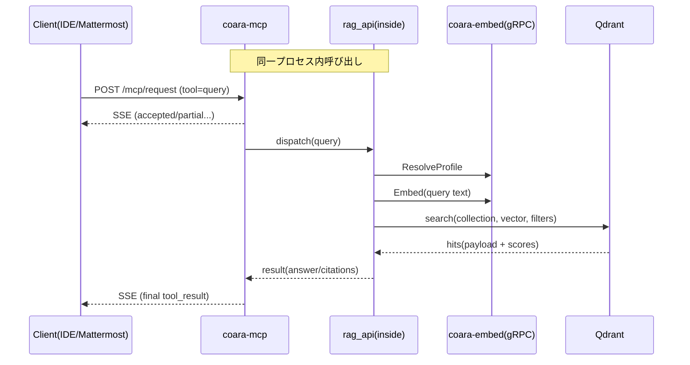
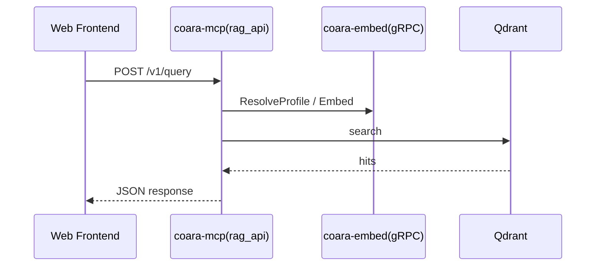

# detailed_designed_coara-mcp.md

ファイル: docs/detailed_designed_coara-mcp.md
版: v0.1（ドラフト）
更新日: 2026-01-29（Asia/Tokyo）

## 1. 目的

本書は coara-mcp（標準MCPサーバ）および同一プロセス内に同居する rag_api（論理RAG API）の詳細設計を定義する。

coara-mcp は次を満たす。

* MCP Python SDK / FastMCP を用いた標準MCPサーバとして動作する
* 外部I/Fは HTTP + SSE とし、パス互換のため GET /mcp/sse と POST /mcp/request を提供する
* MCPツール（query/search/get_snippet/index_status/list_repos/list_profiles など）を提供する
* rag_api（検索・根拠・スニペット提供）を同一プロセス内に実装し、MCPツールおよびHTTP/JSON I/F から呼び出す
* gRPC による下流呼び出しは rag_api → coara-embed に統一する（ResolveProfile / Embed / Health）

本書は、AIエージェントによる VibeCoding 実装の入力文書として利用する。

## 2. 参照

* docs/requirements_specification.md（最新版）
* docs/interface_specification.md（最新版）
* docs/basic_design.md（v0.2）

## 3. スコープ

### 3.1 本書に含む

* coara-mcp（MCPサーバ）外部I/F（HTTP+SSE、MCPツール）
* rag_api（論理RAG API）HTTP/JSON I/F（/v1/query, /v1/snippet, /v1/healthz）
* rag_api の検索パイプライン（埋め込み生成、VectorDB検索、根拠生成、レスポンス整形）
* snippet 取得方法（優先順と実装仕様）
* 設定（configs/coara-mcp.yaml）、依存、起動方式
* エラーハンドリング、認証、ログ、テスト方針
* ソースコード構成

### 3.2 本書に含まない

* チャンク化アルゴリズム（coara-cli）
* 埋め込みモデル運用（coara-embed）
* VectorDB（Qdrant）の運用設計（冗長化、バックアップ、チューニング）
* LLMによる回答生成の最適化（プロンプト、再ランキング高度化）

## 4. 要件トレーサビリティ（抜粋）

| 要件ID      | 要件名         | 本設計での対応                                    |
| --------- | ----------- | ------------------------------------------ |
| FR-MCP-*  | MCPサーバ機能    | /mcp/sse, /mcp/request、ツール提供、SSEイベント       |
| FR-RAG-*  | 検索・根拠・スニペット | rag_api（/v1/query, /v1/snippet）と内部検索パイプライン |
| NFR-SEC-* | オンプレ、秘匿     | オフライン動作、ログ秘匿、認証（任意）                        |
| NFR-OPS-* | 可観測性        | 相関ID、構造化ログ、healthz                         |

注記: 最新の requirements_specification.md / interface_specification.md の要件IDに合わせて表は実装時に最終確定する（本書では名称のみ保持し、番号は揺らぎを許容しない方針）。

## 5. 全体構成

### 5.1 コンポーネントと責務

* coara-mcp（標準MCPサーバ）

  * MCP Python SDK / FastMCP を用いてツールを定義・提供
  * HTTP+SSE で MCP セッションを提供
  * 受信したツール呼び出しを rag_api にディスパッチ（同一プロセス内）

* rag_api（coara-mcp 内部モジュール、論理RAG API）

  * query/search/snippet の実処理
  * coara-embed を gRPC（ResolveProfile/Embed/Health）で呼び出す
  * VectorDB（Qdrant）に検索を発行し、根拠情報を組み立てる
  * HTTP/JSON I/F（/v1/*）と MCPツール（tool=query 等）を同一実装で提供する

* 下流依存

  * coara-embed（gRPC）
  * Qdrant（HTTP）

### 5.2 代表フロー（MCP query）



### 5.3 代表フロー（HTTP/JSON query）



## 6. 技術スタックと起動方式

### 6.1 技術スタック

* 言語: Python 3.11+（推奨）
* MCP: MCP Python SDK または FastMCP（主実装）
* ASGIサーバ: uvicorn（推奨）
* HTTP+SSE: MCP SDK/FastMCP が提供するトランスポートを優先、必要なら互換アダプタ層で /mcp/* を提供
* gRPCクライアント: grpcio
* VectorDBクライアント: Qdrant（HTTPクライアント。requests/httpx のいずれか）
* 設定: YAML（PyYAML 等）
* ログ: Python logging（構造化JSONは任意）
* テスト: pytest、httpx（ASGIテスト）、grpcテスト（スタブ/モック）

### 6.2 起動方式

* エントリポイント: services/coara-mcp/app/server.py
* 起動コマンド例（概念）

```bash
python -m services.coara_mcp.app.server --config configs/coara-mcp.yaml
# または
uvicorn services.coara_mcp.app.server:app --host 0.0.0.0 --port 8080
```

注記: FastMCP の提供方式により app オブジェクトの型が変わるため、実装時は「ASGIアプリを返す関数」を固定し、uvicorn から起動できる形に統一する。

## 7. 設定設計（configs/coara-mcp.yaml）

### 7.1 設定ファイル例（概略）

```yaml
service:
  version: "0.1.0"
  listen: "0.0.0.0:8080"
  base_url: ""                # 逆プロキシ配下なら設定
  request_timeout_sec: 60

mcp:
  transport: "http_sse"
  path_compat:
    enabled: true
    sse_path: "/mcp/sse"
    request_path: "/mcp/request"
  tools_enabled:
    - "query"
    - "search"
    - "get_snippet"
    - "index_status"
    - "list_repos"
    - "list_profiles"

rag_api:
  defaults:
    top_k: 8
    score_threshold: 0.0
    max_snippet_lines: 120
    max_query_chars: 2000
    include_payload_text: false   # Qdrant payload にテキストがある前提を切替
  answer_mode:
    mode: "retrieval_only"        # retrieval_only | generate
    llm_endpoint: ""              # generate時に使用（任意）
    llm_timeout_sec: 30
  repo_content:
    mode: "mirror_fs"             # mirror_fs | qdrant_payload | disabled
    mirror_root: "/srv/coara/repos"
    allow_commit_subdir: true     # mirror_root/<repo_id>/<commit_id>/... を許容
  filters:
    allow_paths: []               # 空なら制限なし
    deny_paths:
      - "**/.git/**"
      - "**/node_modules/**"

embed:
  grpc_endpoint: "coara-embed:50051"
  timeout_sec: 10
  retry:
    max_attempts: 3
    backoff_ms: 200
    backoff_max_ms: 2000

qdrant:
  endpoint: "http://qdrant:6333"
  api_key: ""
  timeout_sec: 10
  retry:
    max_attempts: 3
    backoff_ms: 200
    backoff_max_ms: 2000

repos:
  # list_repos / snippet のための最小情報（初期は設定駆動）
  - repo_id: "repoA"
    display_name: "Repo A"
    mirror_path: "/srv/coara/repos/repoA"
    default_profile: "prof-default"

security:
  auth:
    enabled: false
    type: "api_key"              # api_key | basic | mtls（将来）
    header_name: "X-Coara-Api-Key"
    api_keys: []                 # enabled時に設定
  cors:
    enabled: false
    allow_origins: []

logging:
  level: "INFO"
  redact:
    enabled: true
```

### 7.2 設計ルール

* /mcp/sse と /mcp/request は必ず提供する（互換アダプタで吸収してよい）
* gRPC と Qdrant のタイムアウトは短めにし、上位（MCP/HTTP）のタイムアウトで全体を制御する
* snippet 取得の実装は repo_content.mode で切替可能にする（後述）

## 8. 外部インタフェース設計

### 8.1 MCP I/F（HTTP + SSE）

#### 8.1.1 GET /mcp/sse

* 目的: MCP セッション確立、SSE でイベント配信
* 認証: security.auth.enabled に従う
* 応答: text/event-stream

イベント設計（最小）:

* event: ready
  data: {"session_id":"...","server_version":"..."}

* event: tool_partial
  data: {"request_id":"...","tool":"query","partial":{"stage":"retrieval","progress":0.5}}

* event: tool_result
  data: {"request_id":"...","tool":"query","result":{...}}

* event: tool_error
  data: {"request_id":"...","tool":"query","error":{"code":"INTERNAL","message":"..."}}

注記: MCP SDK/FastMCP が既定のイベントフォーマットを持つ場合はそれに従う。上記は「互換アダプタで独自SSEを出す場合」の最低限仕様。

#### 8.1.2 POST /mcp/request

* 目的: MCPツール呼び出し
* 入力: JSON

  * tool: ツール名
  * params: ツール入力
  * request_id: 任意（無ければサーバが発行しSSEに含める）
* 応答:

  * 202 Accepted（推奨）: SSE で結果通知
  * または 200 OK（同期応答を許す実装でもよいが、SSEが主）

### 8.2 rag_api HTTP/JSON I/F（coara-mcp が提供主体）

#### 8.2.1 POST /v1/query

入力（例）:

```json
{
  "repo_id": "repoA",
  "embedding_profile_id": "prof-default",
  "query": "ログ出力の初期化はどこで行うか",
  "top_k": 8,
  "filters": {
    "path_prefix": "internal/"
  },
  "mode": "retrieval_only"
}
```

出力（例）:

```json
{
  "repo_id": "repoA",
  "embedding_profile_id": "prof-default",
  "query": "...",
  "answer": "",
  "contexts": [
    {
      "score": 0.82,
      "chunk_id": "....",
      "file_path": "internal/ingestion/logging.go",
      "start_line": 12,
      "end_line": 68,
      "symbol": "InitLogging",
      "snippet": "..."
    }
  ],
  "citations": [
    {
      "file_path": "internal/ingestion/logging.go",
      "start_line": 12,
      "end_line": 68,
      "quote": "..."
    }
  ],
  "meta": {
    "model_id": "....",
    "model_version": "....",
    "collection_name": "coara_prof-default",
    "elapsed_ms": 123
  }
}
```

注記:

* mode=generate の場合のみ answer を生成する（設定で LLM が未設定なら retrieval_only に自動フォールバック可）

#### 8.2.2 GET /v1/snippet

* 目的: 指定ファイルの行範囲を返す
* クエリ:

  * repo_id
  * file_path
  * start_line
  * end_line
  * commit_id（任意）
* 出力:

```json
{
  "repo_id": "repoA",
  "file_path": "internal/ingestion/logging.go",
  "commit_id": "abc123",
  "start_line": 12,
  "end_line": 68,
  "text": "..."
}
```

#### 8.2.3 GET /v1/healthz

* 目的: ヘルスチェック
* 応答:

  * サーバ稼働
  * coara-embed Health の結果（任意で含める）
  * Qdrant疎通（任意で含める）

## 9. MCPツール設計

### 9.1 ツール一覧

* query
* search
* get_snippet
* index_status
* list_repos
* list_profiles

ツールは MCP SDK/FastMCP の tool 定義として登録し、入力スキーマ（JSON Schema相当）を固定する。

### 9.2 tool=query

* 目的: 検索し、根拠付きで返す（必要に応じて回答生成）
* 入力:

  * repo_id（必須）
  * query（必須）
  * embedding_profile_id（任意、未指定なら repos.default_profile またはサーバ既定）
  * top_k（任意）
  * filters（任意）
  * mode（任意: retrieval_only|generate）
* 出力:

  * /v1/query と同等の JSON（SSE final で返す）

### 9.3 tool=search

* 目的: 検索結果（チャンク一覧）を返す。回答生成はしない。
* 入力: query と同等（mode は無視）
* 出力:

  * contexts のみ（answer/citations は簡易でもよい）

### 9.4 tool=get_snippet

* 目的: ファイル行範囲のスニペット取得
* 入力:

  * repo_id, file_path, start_line, end_line, commit_id（任意）
* 出力:

  * /v1/snippet と同等

### 9.5 tool=index_status

* 目的: 対象 repo の索引状態（存在、件数、最新コミット等）を返す
* 入力:

  * repo_id
  * embedding_profile_id（任意）
* 出力（例）:

```json
{
  "repo_id": "repoA",
  "embedding_profile_id": "prof-default",
  "collection_name": "coara_prof-default",
  "exists": true,
  "points_estimated": 12345,
  "last_indexed_commit": "",
  "warnings": []
}
```

注記:

* last_indexed_commit は coara-embed から取得するのが理想だが、最小実装では空でもよい（仕様が要求する場合は coara-embed に参照RPCを追加する）

### 9.6 tool=list_repos

* 目的: 利用可能 repo 一覧を返す
* 最小実装: coara-mcp.yaml の repos を返す
* 将来: coara-embed の MetaDB 参照RPC に委譲

### 9.7 tool=list_profiles

* 目的: 利用可能 embedding_profile 一覧を返す
* 実装: coara-embed の ListProfiles（拡張RPC）を呼ぶ

## 10. rag_api 内部設計

### 10.1 モジュール境界

* rag_api は coara-mcp プロセス内の Python パッケージとして実装する
* MCPツールと HTTP/JSON は同一の rag_api 関数を呼ぶ
* 依存関係

  * embed_client（gRPC: coara-embed）
  * vdb_client（Qdrant）
  * repo_reader（snippet取得）
  * policy（フィルタ、アクセス制御）
  * schemas（入出力モデル）

### 10.2 検索パイプライン（query/search 共通）

処理手順:

1. 入力検証

* query の最大長（rag_api.defaults.max_query_chars）
* repo_id の存在確認（設定 repos に存在、または将来MetaDB参照）
* filters の許容範囲（deny_paths 等）

2. embedding_profile 解決

* embedding_profile_id が指定されていればそれを使用
* 未指定なら repos.default_profile またはサーバ既定
* coara-embed ResolveProfile を呼び、collection_name/dimension/normalize/model_id/model_version を取得

3. クエリ埋め込み生成

* coara-embed Embed を呼ぶ（inputs=[query]）
* 返ってきた dimension が profile と一致することを確認

4. VectorDB検索（Qdrant）

* collection_name を指定
* top_k を指定
* フィルタ条件を Qdrant filter に変換

  * repo_id は必須フィルタ（payload.repo_id）
  * path_prefix 等を追加（payload.file_path）
* 取得する payload フィールドは最小限（file_path, start_line, end_line, chunk_id, symbol, commit_id 等）

5. contexts/citations 構築

* hit ごとに file_path と行範囲を取り、snippet を取得（10.3）
* quote は snippet の先頭N文字、または該当行範囲（必要なら整形）
* citations は contexts から派生して生成

6. answer 生成（任意）

* mode=generate かつ llm_endpoint 設定がある場合のみ
* それ以外は answer="" とする（retrieval_only）

7. 応答整形

* /v1/query と MCP tool_result を同一スキーマにする
* elapsed_ms、使用モデル、コレクション名を meta に含める

### 10.3 snippet 取得方式（優先順と仕様）

rag_api.repo_content.mode により切替。

A) mirror_fs（推奨、既定）

* coara-mcp が読み取り可能なミラー領域から取得する
* mirror_root/<repo_id>/<commit_id>/file_path を優先
* commit_id が無い場合は mirror_root/<repo_id>/file_path を許容
* 行数上限: max_snippet_lines
* 改行コードは LF に統一して返す

B) qdrant_payload

* Qdrant payload に chunk_text または snippet_text が入っている前提でそれを返す
* include_payload_text=true の場合のみ有効
* 行範囲の整合は「参考扱い」とし、payload の text を優先して返す

C) disabled

* snippet は返さない（contexts.snippet を空にする）
* /v1/snippet は 501 相当（未対応）にするか、設定で無効化

実装上の注意:

* file_path は常に "/" 区切りの相対パスで扱う
* パストラバーサル対策として正規化後に mirror_root 配下であることを検証する
* 文字コードは UTF-8 を前提、失敗した場合はエラーではなく「取得不可」として空を返す（運用次第で厳格化可）

### 10.4 フィルタとアクセス制御（policy）

* deny_paths にマッチする file_path は検索結果から除外、または snippet を空にする
* allow_paths が設定されている場合、allow にマッチしないパスは除外
* 認証が有効な場合、将来拡張として repo_id 単位のアクセス制御を追加できるように policy 層に集約する

## 11. エラーハンドリング

### 11.1 エラー分類（HTTP/JSON）

* 400: 入力不正（query長、行範囲、必須欠落）
* 401/403: 認証・認可
* 404: repo_id または profile 不明（設定上存在しない）
* 408/504: 下流タイムアウト（gRPC/Qdrant）
* 500: 予期せぬ例外

エラーボディ例:

```json
{
  "error": {
    "code": "INVALID_ARGUMENT",
    "message": "query is too long",
    "request_id": "01H..."
  }
}
```

### 11.2 エラー分類（MCP/SSE）

* tool_error イベントを必ず発行
* request_id を必ず含める
* 内部例外のスタックトレースは返さない（ログにのみ出す）

### 11.3 リトライ方針

* gRPC

  * 再試行対象: UNAVAILABLE, DEADLINE_EXCEEDED（回数制限）
  * 再試行しない: INVALID_ARGUMENT, NOT_FOUND
* Qdrant

  * ネットワーク系のみ短回数リトライ
* いずれも総タイムアウトは service.request_timeout_sec を超えない

## 12. 認証・セキュリティ

最小要件:

* security.auth.enabled=false を既定（閉域前提）
* 有効化した場合の方式:

  * api_key: ヘッダ X-Coara-Api-Key を検証
  * basic: Authorization: Basic を検証（必要なら）
* ログ秘匿:

  * query 文や snippet 本文は原則ログに出さない
  * 出す場合も先頭数十文字に切る、またはハッシュ化する

## 13. ログ・可観測性

* 相関ID:

  * HTTP/JSON: X-Request-Id を受理（無ければ発行）
  * MCP: request_id を受理（無ければ発行）
* 出力項目（推奨）:

  * timestamp, level, request_id, route/tool, repo_id, profile_id
  * elapsed_ms（総処理、下流別）
  * qdrant_hits, top_k
  * error_code（失敗時）
* メトリクス（任意）:

  * /metrics を追加する場合は将来拡張として扱う（本書では必須にしない）

## 14. テスト設計

### 14.1 単体テスト

* policy フィルタ（allow/deny）
* snippet 読み出し（mirror_fs のパス正規化、行抽出）
* Qdrant filter 変換（repo_id/path_prefix など）
* レスポンス整形（contexts/citations）

### 14.2 結合テスト

* ASGIテスト（httpx）で /v1/query, /v1/snippet, /v1/healthz
* gRPCスタブで coara-embed を置き換え

  * ResolveProfile/Embed を固定応答
* Qdrant はモック、またはローカルコンテナで search を実施

### 14.3 E2E（任意）

* coara-cli で小規模リポジトリを index
* coara-mcp で /v1/query または MCP tool=query を実行し、snippet と citations が成立することを確認

## 15. ソースコード構成（coara-mcp）

リポジトリ: coara/services/coara-mcp

```text
services/coara-mcp/
  app/
    server.py                 # ASGI起動点（MCP SDK/FastMCP + 互換ルーティング）
    config.py                 # coara-mcp.yaml ロード/検証
    adapter/
      mcp_paths.py            # /mcp/sse, /mcp/request の互換アダプタ
      sse.py                  # SDK非対応時の最小SSE実装（必要時）
    tools/
      query_tool.py           # MCP tool=query 定義
      search_tool.py
      snippet_tool.py
      status_tool.py
      repos_tool.py
      profiles_tool.py
    rag_api/
      schemas.py              # 入出力モデル
      query.py                # query/search 実装
      snippet.py              # snippet 実装
      health.py               # /v1/healthz 実装
      citations.py            # citations 組み立て
      policy.py               # フィルタ/認可
    embed_client/
      client.py               # gRPCクライアント（ResolveProfile/Embed/Health）
      retry.py
    vdb_client/
      qdrant.py               # Qdrant search / collection info
      retry.py
    repo_reader/
      mirror_fs.py            # mirror_root からの行抽出
      payload.py              # payload text 方式（任意）
  tests/
    unit/
    integration/
  pyproject.toml
```

実装順序（VibeCoding向け推奨）:

1. coara-mcp.yaml のロードと /v1/healthz
2. coara-embed Health 呼び出し（gRPCクライアント）
3. rag_api.query（ResolveProfile→Embed のみ、Qdrantはモック）
4. vdb_client で Qdrant search を接続し、retrieval_only を完成
5. snippet（mirror_fs）を実装し、contexts/citations を完成
6. MCPツール定義（query/search/get_snippet/list_profiles）
7. /mcp/sse と /mcp/request のパス互換アダプタを仕上げ
8. index_status/list_repos を追加
9. 任意で generate モード（LLM呼び出し）を追加

## 16. 未決事項（実装時に確定）

1. list_repos / index_status の情報源

* 最小: coara-mcp.yaml の repos と Qdrant collection info
* 強化: coara-embed MetaDB 参照RPC（ListRepositories, GetLatestIndexRun 等）を追加して一元化
  本書では最小実装を正とし、仕様で必須なら強化案を採用する。

2. snippet の正規ソース

* mirror_fs を推奨するが、運用上ミラーが置けない場合は qdrant_payload 方式に切替する。
  その場合、coara-cli の Qdrant payload に chunk_text を格納する方針が必要になる。

3. generate モードの扱い

* LLM 呼び出し先（ローカルLLM、OpenAI互換、MCP経由など）をどこに固定するかは別決定とする。
  本書の初期実装は retrieval_only を正とする。
