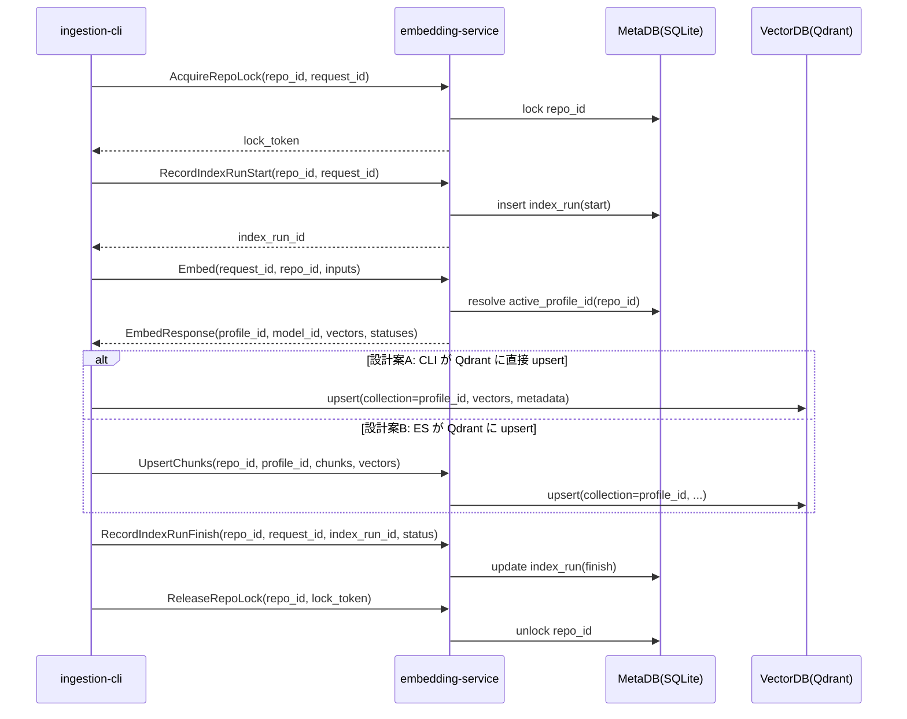
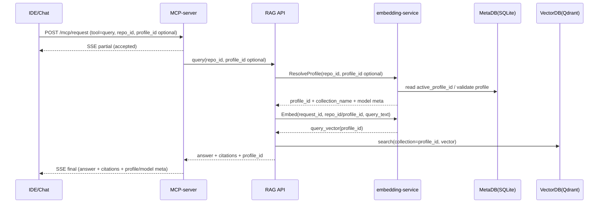
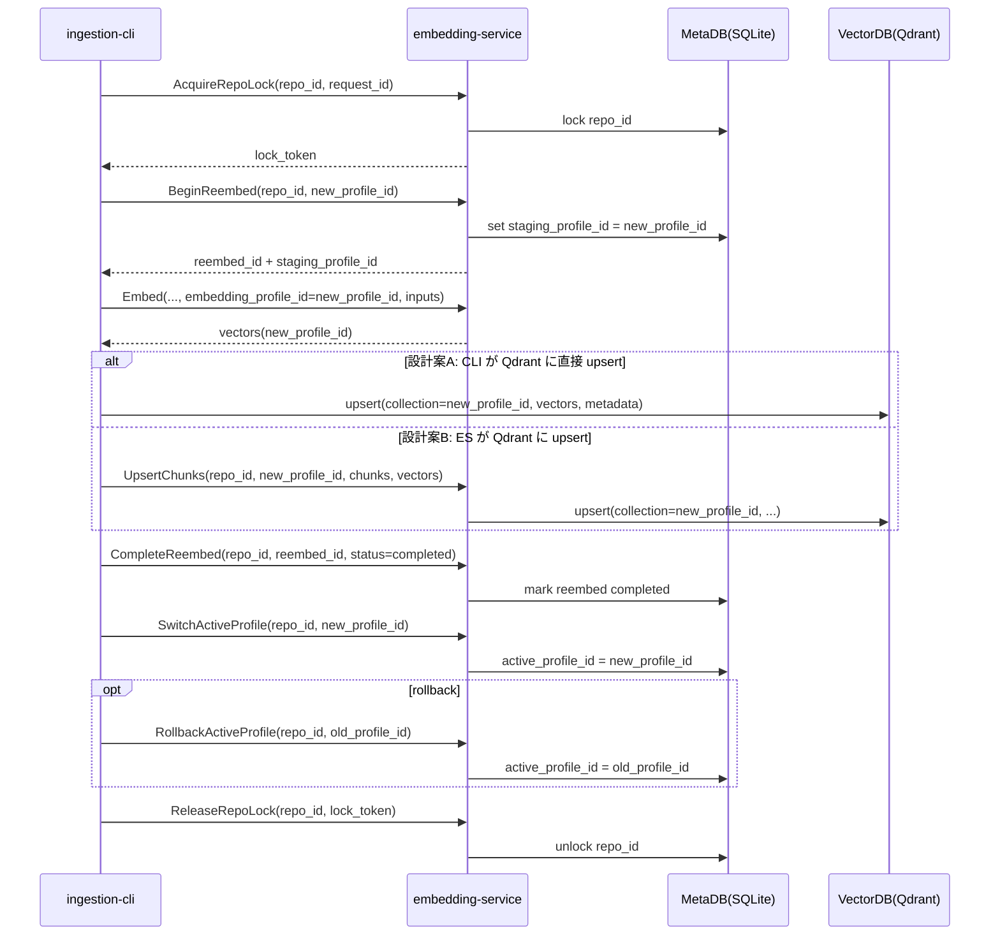

# interface_specification.md

## 1. 目的

本資料は、ソースコード特化RAGシステムにおける以下3コンポーネント間のインタフェース仕様を定義する。

- ingestion-cli（Go / cobra）
- embedding-service（Python / gRPC）
- MCP-server（Python / HTTP + SSE）

特に、ingestion-cli と MCP（経由の検索/回答）で適用モデルが不整合になり検索品質が劣化する問題を避けるため、モデル選択をクライアントから排除し、サーバ側で一元管理する設計の流れ（解決手順、状態遷移、API境界）を明確化する。

本資料は「単純なAPI定義」だけでなく、どの情報をどのコンポーネントが保持し、どの順序で解決し、どこで固定するかを示す。

## 2. スコープ

含む
- embedding profile によるモデル選択の一元化
- ingestion（索引）と query（検索/回答）の両フローにおける profile 解決
- gRPC API（embedding-service）
- HTTP/SSE API（MCP-server）

含まない（別資料で定義）
- RAG API（検索・rerank・生成）本体の内部実装
- VectorDB / MetaDB の物理スキーマ詳細
- チャンク戦略の詳細（AST/トークン制御等）

## 3. 用語

- embedding profile（profile）
  - 運用単位。少なくとも「利用する埋め込みモデル」「前処理」「出力次元」「正規化方式」を束ねる識別子。
  - profile は VectorDB のコレクション分離単位でもある（profile ごとに別コレクション）。
- model_id
  - embedding-service が実際にロードするモデル識別子（例: e5-large, bge-m3 等）。
- repo_id
  - 対象リポジトリの識別子。
- active_profile_id
  - repo_id に対して現在有効な profile。
- staging_profile_id
  - Re-embed 中に並行構築する profile（切替前検証用）。
- request_id / session_id
  - 監査・追跡のための相関ID。
- MetaDB
  - 索引状態・ルーティング・実行履歴・ロックを保持する永続ストア。本設計では SQLite を想定する。

## 4. 設計方針（モデル不整合を起こしにくくする）

### 4.1 クライアントから model_id を排除する

- ingestion-cli と MCP-server は model_id を指定しない。
- クライアントが指定するのは embedding_profile_id（もしくは省略して repo_id から解決）に限定する。
- 実際に使用した model_id / model_version は embedding-service の応答で返し、呼び出し側が監査ログおよびメタ情報として保存する。

目的
- ingestion と query で同一 profile を強制し、ベクトル空間の不一致を回避する。
- Re-embed やロールバック時に、ルーティング切替だけで動作を切り替えられる。

### 4.2 MetaDB はサーバ側で所有し、開発端末から直接アクセスしない

前提
- ingestion-cli は開発端末で実行する。
- 他のサービス（embedding-service, MCP-server, ほか必要なサーバ群）は別サーバで動作する。
- MetaDB（SQLite）はサーバ側にローカル配置し、embedding-service のみが直接読み書きする。

結果
- ingestion-cli が MetaDB に接続する矢印は存在しない。
- ルーティング操作（active_profile_id, staging_profile_id の設定など）やロックは、すべて embedding-service の gRPC 経由で実施する。

### 4.3 profile 解決はサーバ側に集約する

推奨
- embedding-service が profile_registry を持ち、embedding_profile_id → model_id を解決する。
- embedding_profile_id を省略した場合、repo_id から active_profile_id を解決する（MetaDB のルーティング情報を参照）。

代替（非推奨）
- ingestion-cli / MCP-server が profile 解決ロジックをそれぞれ実装する。
  - 実装が分散し、設定差異や更新漏れが起きやすい。

### 4.4 profile 切替（Re-embed）は状態遷移で表現する

- staging_profile_id で新コレクションを構築（並行構築）
- 検証後に active_profile_id を切替
- 問題があれば active_profile_id を戻す（ロールバック）

本仕様では、これら状態遷移操作は embedding-service の Control API として公開する。

## 5. 全体構成と責務

### 5.1 コンポーネント

- ingestion-cli
  - repo の取得・差分検知・チャンク化
  - embedding-service へ埋め込み生成を依頼
  - VectorDB へ upsert（設計案A）、または embedding-service に upsert を委譲（設計案B）
- embedding-service
  - profile 解決、埋め込み生成
  - MetaDB（SQLite）の所有者として、ルーティング・ロック・実行履歴を管理
  - モデル/プロファイルの列挙
  - バッチ入力と部分失敗の返却
- MCP-server
  - 外部クライアント（IDE等）に対するツールインタフェース
  - HTTP POST のリクエストを受け、SSE で partial/final を返す
  - （内部的に）RAG API へ中継。必要に応じて snippet 取得も中継

### 5.2 永続データの所有とアクセス経路

- MetaDB（SQLite）
  - 配置: embedding-service サーバのローカルディスク
  - 直接アクセス可能: embedding-service のみ
  - 他コンポーネント（ingestion-cli, MCP-server, RAG API）は gRPC 経由で参照・更新する
- VectorDB（Qdrant）
  - 配置: サーバ側（別サーバ想定）
  - 書込み経路は以下の2案を許容する
    - 設計案A: ingestion-cli が Qdrant に直接 upsert
    - 設計案B: embedding-service が Qdrant に upsert（CLI は委譲）

運用上の推奨
- 設計案B（Qdrant 書込みもサーバ側に閉じる）にすると、開発端末に Qdrant の認証情報を配布せずに済み、事故が減る。

## 6. インタフェース一覧

### 6.1 embedding-service（gRPC）

Data plane
- Embed
- ListProfiles
- ListModels
- Health

Control plane（MetaDB 操作を含む）
- ResolveProfile
- AcquireRepoLock
- ReleaseRepoLock
- BeginReembed
- CompleteReembed
- SwitchActiveProfile
- RollbackActiveProfile
- RecordIndexRunStart
- RecordIndexRunFinish
- GetIndexStatus
- ListRepos

### 6.2 MCP-server（HTTP + SSE）

- GET /mcp/sse
- POST /mcp/request

tool（POST /mcp/request の payload.tool）
- query
- search
- get_snippet
- index_status
- list_repos
- list_profiles

## 7. profile 解決フロー（正規手順）

### 7.1 ingestion（索引）時

1. ingestion-cli は対象 repo_id を決定
2. ingestion-cli は embedding-service に対して repo ロックを取得する
3. ingestion-cli は profile を明示指定しない（通常は省略）
   - ただし Re-embed 実行時は target_profile_id を指定してよい
4. ingestion-cli は embedding-service の Embed を呼び出す（repo_id と inputs を渡す）
5. embedding-service は以下で profile を解決する
   - if request.embedding_profile_id が指定されていればそれを採用
   - else repo_id の active_profile_id を MetaDB から参照して採用
6. embedding-service は profile に対応する model_id をロード/選択し埋め込み生成
7. embedding-service は応答に profile_id, model_id, model_version, dimension 等を含める
8. ingestion-cli は Qdrant へ upsert（設計案A）または embedding-service に upsert を委譲（設計案B）
9. ingestion-cli は embedding-service の RecordIndexRunFinish を呼び、実行履歴を確定する
10. ingestion-cli は repo ロックを解放する

重要
- ingestion-cli は MetaDB を直接参照しない。
- active/staging などの状態は embedding-service が MetaDB（SQLite）に対して更新する。

### 7.2 query（検索/回答）時（MCP経由）

1. クライアントは POST /mcp/request tool=query を送る
2. MCP-server は args から repo_id と（任意で）embedding_profile_id を抽出
3. MCP-server は（内部）RAG API に中継する
4. RAG API は profile 解決が必要な場合、embedding-service の ResolveProfile を呼ぶ
5. query embedding 生成時は embedding-service の Embed を呼ぶ（repo_id または embedding_profile_id を渡す）
6. 以後の検索は「対象コレクション = profile コレクション」と一致させる

重要
- query embedding の profile と検索対象コレクションの profile は必ず一致させる。
- これにより ingestion と query の不整合を構造的に排除する。

## 8. gRPC インタフェース仕様（embedding-service）

本章では、データ平面（Embed）と制御平面（MetaDB 操作）を同一の gRPC サービスに定義する例を示す。
実装上はサービス分割してもよいが、呼び出し側の責務分散を避けるため、API提供点は embedding-service に集約する。

### 8.1 Protocol Buffers（概略）

```proto
syntax = "proto3";

package embedding.v1;

service EmbeddingService {
  // Data plane
  rpc Embed(EmbedRequest) returns (EmbedResponse);
  rpc ListProfiles(ListProfilesRequest) returns (ListProfilesResponse);
  rpc ListModels(ListModelsRequest) returns (ListModelsResponse);
  rpc Health(HealthRequest) returns (HealthResponse);

  // Control plane
  rpc ResolveProfile(ResolveProfileRequest) returns (ResolveProfileResponse);
  rpc AcquireRepoLock(AcquireRepoLockRequest) returns (AcquireRepoLockResponse);
  rpc ReleaseRepoLock(ReleaseRepoLockRequest) returns (ReleaseRepoLockResponse);

  rpc BeginReembed(BeginReembedRequest) returns (BeginReembedResponse);
  rpc CompleteReembed(CompleteReembedRequest) returns (CompleteReembedResponse);
  rpc SwitchActiveProfile(SwitchActiveProfileRequest) returns (SwitchActiveProfileResponse);
  rpc RollbackActiveProfile(RollbackActiveProfileRequest) returns (RollbackActiveProfileResponse);

  rpc RecordIndexRunStart(RecordIndexRunStartRequest) returns (RecordIndexRunStartResponse);
  rpc RecordIndexRunFinish(RecordIndexRunFinishRequest) returns (RecordIndexRunFinishResponse);

  rpc GetIndexStatus(GetIndexStatusRequest) returns (GetIndexStatusResponse);
  rpc ListRepos(ListReposRequest) returns (ListReposResponse);
}

message EmbedRequest {
  string request_id = 1;               // 監査相関ID
  string repo_id = 2;                  // 省略可: profile_id を指定する場合
  string embedding_profile_id = 3;     // 省略可: repo_id から active を解決
  repeated string inputs = 4;          // バッチ入力
  bool normalize = 5;                  // 省略可
}

message EmbedResponse {
  string request_id = 1;

  string embedding_profile_id = 2;     // 解決後の profile
  string model_id = 3;
  string model_version = 4;
  uint32 dimension = 5;
  string normalization = 6;            // "none" | "l2" 等

  repeated Vector vectors = 10;        // inputs と同順
  repeated ItemStatus statuses = 11;   // 部分失敗を表現
  repeated string warnings = 12;
}

message Vector { repeated float values = 1; }

message ItemStatus {
  uint32 index = 1;        // inputs[index]
  bool ok = 2;
  string error_code = 3;   // "INPUT_TOO_LONG" 等
  string message = 4;
}

message ListProfilesRequest {}
message ListProfilesResponse { repeated ProfileInfo profiles = 1; }
message ProfileInfo {
  string embedding_profile_id = 1;
  string model_id = 2;
  string model_version = 3;
  uint32 dimension = 4;
  string normalization = 5;
  string status = 6;       // "active" | "deprecated" 等
}

message ListModelsRequest {}
message ListModelsResponse { repeated ModelInfo models = 1; }
message ModelInfo {
  string model_id = 1;
  string model_version = 2;
  uint32 dimension = 3;
  uint32 max_input_length = 4;
  string normalization = 5;
}

message HealthRequest {}
message HealthResponse { string status = 1; }

// Control plane messages

message ResolveProfileRequest {
  string repo_id = 1;
  string embedding_profile_id = 2; // 任意: 指定時は検証してそのまま返す
}

message ResolveProfileResponse {
  string repo_id = 1;
  string embedding_profile_id = 2;
  string collection_name = 3;      // Qdrant collection（profile と 1:1）
  string model_id = 4;
  string model_version = 5;
  uint32 dimension = 6;
  string normalization = 7;
}

message AcquireRepoLockRequest {
  string repo_id = 1;
  string request_id = 2;
  uint32 ttl_seconds = 3;          // 任意
}
message AcquireRepoLockResponse {
  string repo_id = 1;
  string lock_token = 2;
  uint32 ttl_seconds = 3;
}

message ReleaseRepoLockRequest {
  string repo_id = 1;
  string lock_token = 2;
}
message ReleaseRepoLockResponse {
  string repo_id = 1;
  bool released = 2;
}

message BeginReembedRequest {
  string repo_id = 1;
  string new_embedding_profile_id = 2;
  string request_id = 3;
}
message BeginReembedResponse {
  string repo_id = 1;
  string reembed_id = 2;
  string staging_profile_id = 3;
}

message CompleteReembedRequest {
  string repo_id = 1;
  string reembed_id = 2;
  string request_id = 3;
  string status = 4; // "completed" | "failed"
}
message CompleteReembedResponse {
  string repo_id = 1;
  string reembed_id = 2;
  string status = 3;
}

message SwitchActiveProfileRequest {
  string repo_id = 1;
  string new_active_profile_id = 2;
  string request_id = 3;
}
message SwitchActiveProfileResponse {
  string repo_id = 1;
  string active_profile_id = 2;
}

message RollbackActiveProfileRequest {
  string repo_id = 1;
  string old_active_profile_id = 2;
  string request_id = 3;
}
message RollbackActiveProfileResponse {
  string repo_id = 1;
  string active_profile_id = 2;
}

message RecordIndexRunStartRequest {
  string repo_id = 1;
  string request_id = 2;
  string embedding_profile_id = 3; // 任意
}
message RecordIndexRunStartResponse {
  string repo_id = 1;
  string index_run_id = 2;
  string embedding_profile_id = 3;
}

message RecordIndexRunFinishRequest {
  string repo_id = 1;
  string request_id = 2;
  string index_run_id = 3;
  string status = 4;              // "success" | "failed"
  uint32 processed_chunks = 5;
  uint32 failed_chunks = 6;
  string error_summary = 7;
}
message RecordIndexRunFinishResponse {
  string repo_id = 1;
  string index_run_id = 2;
  string status = 3;
}

message GetIndexStatusRequest { string repo_id = 1; }
message GetIndexStatusResponse {
  string repo_id = 1;
  string active_profile_id = 2;
  string staging_profile_id = 3;
  string last_index_run_id = 4;
  string last_status = 5;
  string last_completed_at = 6;
}

message ListReposRequest {}
message ListReposResponse { repeated RepoInfo repos = 1; }
message RepoInfo { string repo_id = 1; string display_name = 2; }
```

### 8.2 Embed の振る舞い

- profile 解決
  - embedding_profile_id 指定時はそれを採用（存在検証を行う）
  - 未指定時は repo_id を用いて active_profile_id を MetaDB から解決
  - いずれも無い場合は INVALID_ARGUMENT
- 部分失敗
  - 入力が長すぎる等は item 単位で statuses に失敗を返す
  - 全体の gRPC status は OK とし、クライアントが statuses を見て扱う
  - ただしサーバ異常やモデル未ロード等は gRPC status をエラーにする
- 監査
  - request_id と解決した profile/model をログ・メトリクスに出す
  - 応答にも model_version を必ず返す

### 8.3 エラーコード例（error_code）

- INVALID_PROFILE
- MODEL_NOT_AVAILABLE
- INPUT_TOO_LONG
- INPUT_EMPTY
- INTERNAL_ERROR
- RATE_LIMITED
- LOCK_NOT_ACQUIRED

## 9. HTTP/SSE インタフェース仕様（MCP-server）

### 9.1 SSE 接続

- GET /mcp/sse
  - Content-Type: text/event-stream
  - イベント種別は event フィールドでも良いが、本仕様では data 内の type を必須とする

data の最小形

```json
{
  "type": "partial",
  "session_id": "s-123",
  "request_id": "r-456",
  "payload": {}
}
```

type の値
- partial: 途中経過
- final: 最終結果
- error: エラー
- notification: 心拍等

推奨
- 5〜15秒程度の間隔で notification を送信し、NAT/Proxy 切断を避ける
- 再接続用に Last-Event-ID を扱える設計にする（実装で対応）

### 9.2 ツール要求

- POST /mcp/request
  - Content-Type: application/json

```json
{
  "session_id": "s-123",
  "request_id": "r-456",
  "tool": "query",
  "args": {
    "query": "この関数の責務は？",
    "repo_id": "repo-1",
    "embedding_profile_id": "prof-code-v1",
    "top_k": 20,
    "filters": { "path_prefix": "src/" }
  },
  "context": {
    "client_type": "IDE",
    "user_id": "userA"
  }
}
```

設計ルール
- embedding_profile_id は省略可能。省略時は repo_id から active を解決する（RAG API から embedding-service の ResolveProfile を呼ぶ）。
- model_id は受け付けない（受け取っても無視、またはバリデーションエラー）。

### 9.3 tool ごとの args（概要）

- query
  - query: string
  - repo_id: string
  - embedding_profile_id: string（任意）
  - top_k: number（任意）
  - filters: object（任意）
- search
  - query, repo_id, embedding_profile_id（任意）, top_k, filters
- get_snippet
  - repo_id, file_path, start_line, end_line, context_lines（任意）
- index_status
  - repo_id
- list_repos
  - なし（または prefix 等）
- list_profiles
  - なし（または status フィルタ）

### 9.4 query の SSE 応答例（final）

```json
{
  "type": "final",
  "session_id": "s-123",
  "request_id": "r-456",
  "payload": {
    "answer": "…",
    "citations": [
      { "file_path": "src/a.go", "start_line": 10, "end_line": 40, "score": 0.72 }
    ],
    "embedding_profile_id": "prof-code-v1",
    "model_id": "bge-m3",
    "model_version": "sha256:...."
  }
}
```

## 10. シーケンス（設計の流れが分かる図）

本章の図は、開発端末から MetaDB（SQLite）へ直接アクセスしない前提で記述している。
MetaDB への読み書きは embedding-service が実施する。

### 10.1 ingestion（通常索引）



注記
- 設計案Bの UpsertChunks は、本資料では説明用に記載している。実際に採用する場合は gRPC 定義へ追加する。

### 10.2 query（MCP経由）



### 10.3 Re-embed（切替とロールバック）



## 11. 互換性とバージョニング

- gRPC/HTTP の互換性
  - 既存フィールドの削除は禁止
  - optional フィールド追加で拡張
- profile とモデル
  - profile は不変識別子として扱い、内容を変える場合は新 profile を作成する
  - model_version（artifact hash）を常に応答・記録し、再現性を担保する

## 12. セキュリティと監査（最低限）

- 認証
  - MCP-server: クライアント種別ごとにトークンまたは mTLS を分離
  - embedding-service: 内部ネットワーク限定 + mTLS を推奨
- 監査ログ
  - request_id, session_id, repo_id, embedding_profile_id, model_id, model_version
  - 入力全文のログは避け、ハッシュやサイズのみを記録（機微情報対策）
- 権限
  - repo_id ごとに参照可能ユーザ/クライアントを制御できる拡張余地を残す

## 13. 実装メモ（最小実装でズレを防ぐチェック）

- ingestion-cli
  - model_id を config に持たせない
  - MetaDB に直接アクセスしない
  - Re-embed 以外は profile_id を指定しない（repo_id のみで Embed）
  - EmbedResponse の profile/model 情報を必ずログおよびサーバ側の履歴に残す
- embedding-service
  - MetaDB（SQLite）の唯一の所有者として読み書きする
  - profile_registry（profile_id→model_id 等）を単一の設定ファイル/DBで管理
  - repo_id→active_profile_id 解決の参照先を一箇所に固定
  - staging/active 切替は Control plane API として提供し、トランザクション境界をサーバに閉じる
- MCP-server
  - リクエストで model_id を受け取らない
  - final 応答に profile_id と model_id/version を含め、クライアント側に可視化可能にする
