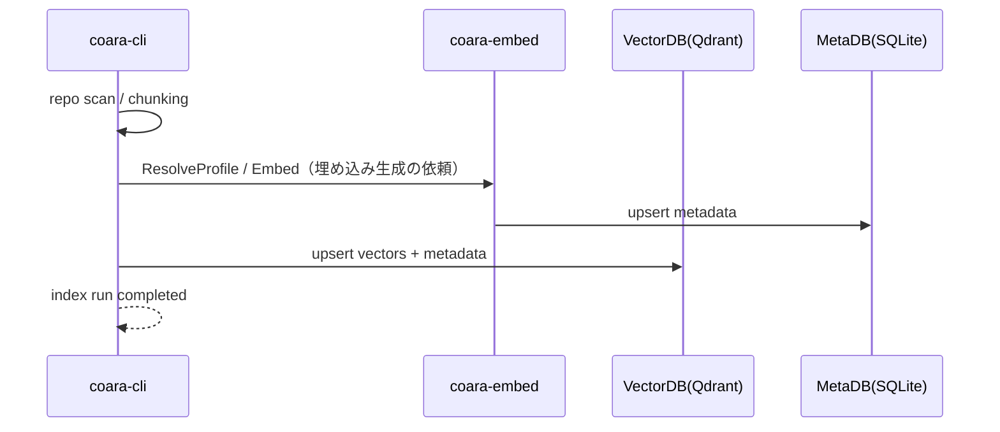
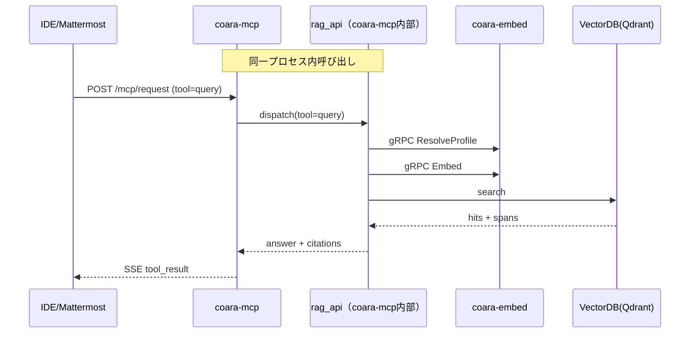
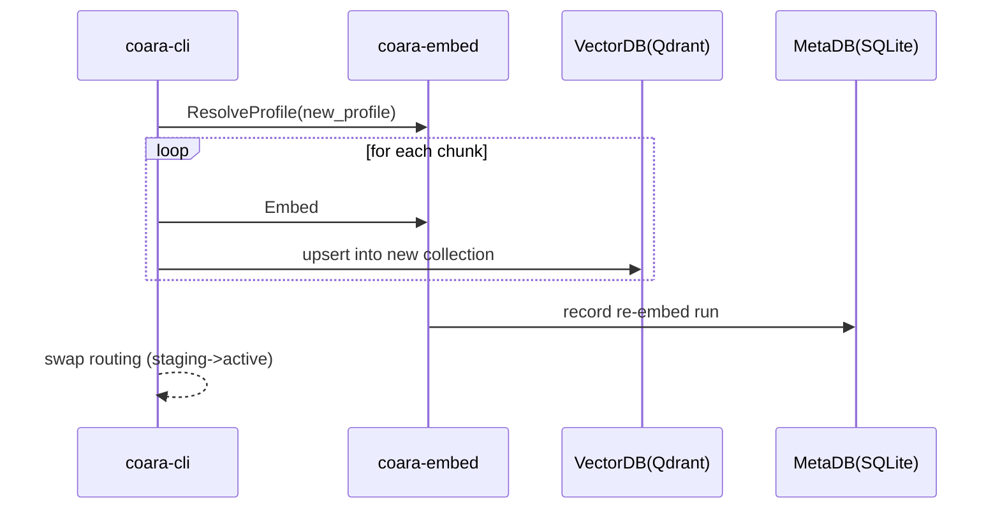

# coara（ソースコード特化RAGシステム）インタフェース仕様書

ファイル: docs/interface_specification.md  
版: v0.5（ドラフト）  
更新日: 2026-01-25（Asia/Tokyo）

## 1. 目的

本資料は、coara（ソースコード特化RAGシステム）における以下コンポーネント間のインタフェース仕様を定義する。

- coara-cli（Go / cobra、旧称: ingestion-cli）
- coara-embed（Python / gRPC、旧称: embedding-service）
- coara-mcp（Python / MCP Python SDK または FastMCP / HTTP + SSE、旧称: MCP-server）

併せて、RAG API を論理境界（rag_api）として定義し、初期実装は coara-mcp 内部モジュールに同居する前提を明記する。

## 2. 対象範囲

### 2.1 含む
- coara-cli / coara-embed / coara-mcp 間の通信仕様（主要シナリオ）
- coara-mcp の MCP I/F（HTTP + SSE）
- rag_api の配置前提（coara-mcp 内部同居）と、rag_api → coara-embed の gRPC 呼び出し

### 2.2 含まない
- rag_api の内部アルゴリズム（検索・再ランキング・プロンプト等）の詳細
  - ただし、本書では rag_api を coara-mcp 内部に同居させる配置前提は明確化する
- VectorDB（Qdrant）の詳細なスキーマ設計、運用設計
- IDEプラグインやMattermostアプリ固有のUI仕様

## 3. 用語
- coara: 本システムのリポジトリ名（旧称: repo-root）
- rag_api: 検索・回答の論理機能境界（RAG API）。初期実装は coara-mcp 内部モジュールとして同居する
- embedding_profile: モデル、前処理、チャンクポリシー等を束ねた運用プロファイル
- collection: VectorDB上の論理区分（embedding_profile単位で分離）
- MetaDB: SQLite。Profile/Repository/IndexRun/Chunk/EmbeddingRecord等のメタ情報を保持する
- MCP: クライアント（IDE、Mattermost等）に対してツール呼び出しを提供するプロトコル（HTTP + SSE）

## 4. 前提と設計上の重要点

### 4.1 embedding_profile によるモデル選択
- 実行時のモデル選択はサーバ側（coara-embed）で決定する
- クライアントは原則 embedding_profile_id を指定し、coara-embed が model_id 等へ解決する（ResolveProfile）
- model_id の直接指定は運用者または内部用途に限定してよい

### 4.2 MetaDB の所有者
- MetaDB（SQLite）は coara-embed が所有し、更新責務を持つ
- 開発端末上の coara-cli は MetaDB へ直接アクセスしない（サーバ側API経由で更新される）

### 4.3 RAG API の位置づけ
- RAG API は「検索・回答」の論理境界であり、初期実装は coara-mcp 内部の rag_api モジュールに同居する
- 将来の独立サービス化の余地は残すが、本書の初期前提は同居で統一する

### 4.4 coara-mcp の実装方針とパス互換
- coara-mcp は標準MCPサーバとして MCP Python SDK / FastMCP を主に採用する
- 外部I/F（HTTP + SSE）はパス互換のため、以下を維持する
  - GET /mcp/sse
  - POST /mcp/request
- SDK/FastMCPの既定パスが異なる場合は、coara-mcp 側に互換アダプタ（ルーティング層）を置く

## 5. コンポーネント責務

### 5.1 coara-cli
- リポジトリの探索、差分検知、解析・チャンク化
- VectorDB（Qdrant）への upsert
- 埋め込み生成とメタ更新に必要な情報をサーバ側へ依頼する

### 5.2 coara-embed
- embedding_profile 解決（ResolveProfile）
- 埋め込み生成（Embed）
- MetaDB（SQLite）の所有と更新（Profile/Repository/IndexRun等）
- 監視/ヘルスチェック

### 5.3 coara-mcp
- 標準MCPサーバとして、ツール呼び出し（HTTP + SSE）を提供する
- rag_api（coara-mcp内部）に中継する（同一プロセス内呼び出し）
- 外部I/FはMCP（/mcp/*）であり、coara-mcp外部へgRPCを直接公開しない

### 5.4 rag_api（coara-mcp内部）
- 検索・回答の論理機能を実装する
- coara-embed を gRPC（ResolveProfile / Embed）で呼び出す
- VectorDB（Qdrant）へ検索クエリを発行し、根拠スパン付きで結果を組み立てる

## 6. インタフェース一覧

### 6.1 coara-embed gRPC
- 利用者: rag_api（coara-mcp内部）
- 主要RPC
  - ResolveProfile: embedding_profile_id → model_id, dimension, collection_name 等
  - Embed: embedding_profile_id, inputs[] → vectors[][]
  - Health: 稼働確認

### 6.2 coara-mcp MCP I/F（HTTP + SSE）
- GET /mcp/sse
  - サーバ→クライアントのイベント配送（SSE）
- POST /mcp/request
  - クライアント→サーバのツール呼び出し要求

補足:
- SDK/FastMCPの既定I/Fと異なる場合も、coara-mcp は上記パス互換を維持する

### 6.3 rag_api HTTP I/F（coara-mcp が提供主体）
- POST /v1/query
- GET /v1/snippet
- GET /v1/healthz

## 7. シナリオ別インタラクション

### 7.1 インデックス（取り込み）
- coara-cli がリポジトリを解析し、チャンク化する
- 埋め込み生成は coara-embed を利用する（モデル選択は embedding_profile に従いサーバ側で決定）
- coara-cli は VectorDB へ upsert を行う
- MetaDB 更新は coara-embed が行う（coara-cli は直接アクセスしない）

### 7.2 問い合わせ（MCP: IDE/Mattermost）
- クライアントは coara-mcp へツール呼び出しを行う（/mcp/request）
- coara-mcp は同一プロセス内の rag_api に中継する
- rag_api は coara-embed を gRPC（ResolveProfile / Embed）で呼び出し、VectorDB を検索する
- 結果は coara-mcp から SSE（/mcp/sse）で返却する

### 7.3 問い合わせ（Web）
- Web Frontend は coara-mcp が提供する rag_api HTTP I/F（/v1/query 等）を利用する
- 内部処理は 7.2 と同様に rag_api → coara-embed（gRPC）→ VectorDB の経路を取る

## 8. coara-embed gRPC仕様（proto概略）

以下は概念レベルの例であり、実装時はフィールド追加や型の厳密化を行ってよい。

```proto
syntax = "proto3";
package coara.embed.v1;

service CoaraEmbed {
  rpc ResolveProfile(ResolveProfileRequest) returns (ResolveProfileResponse);
  rpc Embed(EmbedRequest) returns (EmbedResponse);
  rpc Health(HealthRequest) returns (HealthResponse);
}

message ResolveProfileRequest {
  string embedding_profile_id = 1;
}

message ResolveProfileResponse {
  string embedding_profile_id = 1;
  string model_id = 2;
  string model_version = 3;
  uint32 dimension = 4;
  bool normalize = 5;
  string collection_name = 6;
}

message EmbedRequest {
  string embedding_profile_id = 1;
  repeated string inputs = 2;
  bool normalize = 3; // optional（未指定時はprofileの規定に従う）
}

message EmbedResponse {
  string embedding_profile_id = 1;
  string model_id = 2;
  string model_version = 3;
  uint32 dimension = 4;
  repeated Vector vectors = 5;
}

message Vector {
  repeated float values = 1;
}

message HealthRequest {}
message HealthResponse {
  string status = 1;   // e.g. "ok"
  string version = 2;  // service version
}
```

## 9. coara-mcp MCP I/F 仕様（HTTP + SSE）

### 9.1 GET /mcp/sse
- SSEストリームを開始する
- イベント例
  - tool_list
  - tool_result
  - error
  - heartbeat

### 9.2 POST /mcp/request
- リクエストを送信する
- 例（概念）
```json
{
  "session_id": "s-123",
  "request_id": "r-456",
  "tool": "query",
  "args": {
    "query": "....",
    "embedding_profile_id": "prof-default"
  }
}
```

### 9.3 ツール一覧（代表）
- query
- search
- get_snippet
- index_status
- list_repos
- list_profiles

## 10. シーケンス図

### 10.1 インデックス（概略）


### 10.2 問い合わせ（MCP）


### 10.3 Re-embed（概略）


## 11. 互換性とバージョニング
- MCPパス互換（/mcp/sse, /mcp/request）は破壊的変更として扱う
- gRPCの破壊的変更はメジャーバージョンでのみ許容する
- rag_api の同居前提は初期仕様で固定し、将来の独立化は別版の仕様書で扱う

## 12. 変更点要約
- 命名を coara-*（coara-cli / coara-embed / coara-mcp）へ統一し、旧称は冒頭で1回のみ記載した
- coara-mcp を標準MCPサーバ（MCP Python SDK / FastMCP）として明記し、/mcp/sse と /mcp/request のパス互換を前提化した
- RAG API を論理境界 rag_api として定義し、初期実装は coara-mcp 内部同居で統一した
- gRPC 呼び出しを rag_api（coara-mcp内部）→ coara-embed（ResolveProfile / Embed）として明確化した
- MetaDB の所有と更新責務を coara-embed に集約し、coara-cli の直接アクセスを前提としない記述に揃えた
