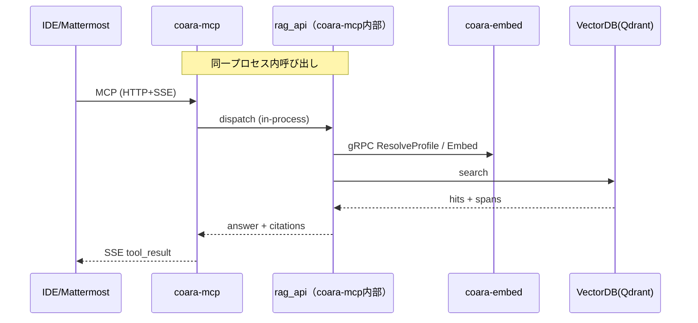

# coara ソースコード特化RAGシステム 要件定義書
ファイル: docs/requirements_specification.md  
版: v0.5（ドラフト）  
更新日: 2026-01-25（Asia/Tokyo）

## 1.目的
本書は、ソースコードに特化したRAG（Retrieval Augmented Generation）基盤「coara」の要件を定義する。主な利用者は社内開発者であり、IDE（VS Code 等）およびMattermost から、検索・根拠提示付きの回答生成を行えることを目指す。

## 2. 背景
- 仕様書・設計書・ソースコードが分散しており、必要な情報に素早くアクセスできない
- オンプレ環境での運用が必須であり、クラウド依存を避けたい
- 埋め込みモデルやチャンクポリシーの見直しが発生するため、再埋め込み（Re-embed）に耐える設計が必要
- coara-embedは取り込み（coara-cli）と問い合わせ（rag_api）双方から利用するため独立サービスとして構築する

## 3. システム概要

### 3.1 目的と提供価値
- Gitリポジトリを対象に、ソースコードをチャンク化し、VectorDBへ登録する
- 問い合わせに対して、根拠（該当ファイルと行範囲）を提示しながら回答を生成する
- IDE/Mattermost 連携により、開発者の情報探索コストを低減する

### 3.2 主要ユースケース
- 取り込み（インデックス）: 開発端末またはCIで coara-cli を実行し、対象リポジトリをVectorDBへ登録する
- 問い合わせ（MCP）: IDE/Mattermost から coara-mcp を通じて検索・回答する
- 問い合わせ（Web）: Web UIから検索・根拠表示・履歴閲覧を行う
- 再埋め込み: embedding_profile を変更し、既存データを再埋め込みする
- 監査ログ、運用監視、バックアップ
### 3.3 対象外（初期）
- バイナリ解析、逆コンパイル、OCR
- インターネット検索を前提とする外部情報統合
- ソースコードの自動改変・自動コミット（提案生成は可、適用は人が実施）

## 4. 用語
- coara: 本システムのリポジトリ（repo-root）。旧称: repo-root
- coara-cli: 取り込み・索引の実行用CLI。
- coara-embed: 埋め込み生成サービス。
- coara-mcp: 標準MCPサーバ（MCP Python SDK / FastMCP）実装。
- rag_api: 検索・回答の論理機能境界（RAG APIの実装単位）。初期実装は coara-mcp 内部モジュールとして同居する
- コレクション: VectorDB上の論理区分（embedding_profile単位で分離）
- チャンク: 検索単位の分割片（関数、クラス、設定ブロック等）
- スパン（根拠スパン）: file_path + start_line + end_line で示す根拠範囲
- embedding_profile: モデル、前処理、チャンクポリシー等を束ねた運用上のプロファイル
- Re-embed: 既存チャンクを新しいembedding_profileで再埋め込みし、新コレクションを構築すること
- MCP: 統合用ゲートウェイ。クライアント（IDE、Mattermost等）に対してツール呼び出しを提供する
- インデックス（本書）: チャンク化＋埋め込み生成＋VectorDB登録＋MetaDB更新までの一連の処理

## 5. 前提・制約
- 完全オンプレミス、運用時はインターネット非接続
- モデル・依存パッケージはオフライン配布（社内ミラー、NAS等）で更新可能
- 機密コードの外部送信は禁止
- 監査・証跡が必要（誰が、いつ、何を問い合わせ、どの根拠を返したか）
- VectorDBは Qdrant を想定する
- MetaDBはSQLiteを想定し、サーバ側で所有・更新する
- 埋め込みモデルは複数を切り替え可能とし、embedding_profile により運用する
- coara-embedは独立サービスとして提供し、coara-cli と rag_api から利用できる（rag_api からは gRPC で呼び出す）
- coara-mcp外部I/FはMCP（HTTP+SSE）とし、gRPCを直接公開しない

## 6. 論理構成

### 6.1 論理コンポーネント
- coara-cli（単一コンポーネント）
  - Git取り込み、差分検知、解析・チャンク化
  - 埋め込み生成の依頼（coara-embedを利用）
  - VectorDB（Qdrant）への upsert（登録/更新）
  - MetaDBの更新依頼（coara-embed経由。開発端末からMetaDBへ直接アクセスしない）
  - Re-embed実行（新しいembedding_profileで再埋め込みし、新コレクション構築）
- coara-embed（独立サービス）
  - embedding_profile解決（ResolveProfile）と埋め込み生成（Embed）
  - 実行時のモデル選択はサーバ側で決定する（クライアントは embedding_profile_id を指定）
  - MetaDB（SQLite）の所有と更新（Profile/Repository/IndexRun/Chunk/EmbeddingRecord等）
- coara-mcp（標準MCPサーバ）
  - MCP Python SDK / FastMCP を主として実装し、HTTP + SSE でMCPツール呼び出しを提供する
  - 外部I/Fはパス互換のため GET /mcp/sse と POST /mcp/request を維持する
    - SDK/FastMCPの既定パスが異なる場合は、coara-mcp側に互換アダプタ（ルーティング層）を置く
  - 内部に rag_api モジュールを同居させ、問い合わせ処理を中継する（同一プロセス内呼び出し）
- rag_api（論理境界、初期実装は coara-mcp 内部に同居）
  - 検索・回答（retrieval + rerank + answer）を担う論理機能境界
  - coara-embed を gRPC（ResolveProfile / Embed）で呼び出す
  - VectorDB（Qdrant）へ検索クエリを発行し、根拠スパン付きで結果を組み立てる
- VectorDB（Qdrant）
  - チャンクベクトルとメタデータ（file_path、行範囲、repo_id等）を保持
- Web Frontend
  - HTTP API（/v1/query 等）を用いて検索・根拠表示・履歴を提供
  - 初期実装では coara-mcp（rag_api同居）が提供主体となる
- Mattermost Connector（Bot/App）
  - coara-mcp（MCP）を経由して問い合わせを行い、回答を投稿する

### 6.2 代表的データフロー
- 取り込み（インデックス）
  - 開発端末で coara-cli を実行し、対象リポジトリを解析・チャンク化する
  - coara-cli は coara-embed に対して embedding_profile の解決と埋め込み生成を依頼する
  - coara-cli は VectorDB（Qdrant）へチャンクを upsert する
  - MetaDB（SQLite）への更新は coara-embed が実施する（coara-cli は直接アクセスしない）
- 問い合わせ（Web）
  - Web Frontend → coara-mcp（HTTP API: /v1/query 等）→ rag_api（coara-mcp内部）
  - rag_api → coara-embed（gRPC: ResolveProfile / Embed）→ VectorDB（検索）
  - VectorDB → rag_api → coara-mcp → Web Frontend
- 問い合わせ（MCP: IDE/Mattermost 等）
  - IDE/Mattermost → coara-mcp（SSE）→ rag_api（同居）→ coara-embed（gRPC）→ VectorDB → rag_api → coara-mcp（SSE）

参考（問い合わせ: MCP のシーケンス）

## 7. 機能要件

### 7.1 coara-cli 要件
- FR-CLI-001 リポジトリ指定
  - ローカルパスまたはGit URLで対象を指定できる
- FR-CLI-002 対象範囲指定
  - include/exclude パターンで対象ファイルを制御できる
- FR-CLI-003 チャンク化
  - 言語別にチャンク化ルールを適用できる（最小: Markdown, C/C++, Python, Go, Java）
- FR-CLI-004 差分インデックス
  - 変更ファイルのみ再処理できる
- FR-CLI-005 VectorDB登録
  - upsert で登録・更新できる
- FR-CLI-006 失敗時の継続
  - ファイル単位の失敗で全体を停止しない設定を持つ
- FR-CLI-007 実行モード
  - full / incremental / re-embed を選択できる
- FR-CLI-008 MetaDB更新
  - Repository/IndexVersion/Chunk/EmbeddingRecord等の更新を coara-embed（MetaDB）に依頼し、追跡可能とする
- FR-CLI-009 進捗出力
  - 進捗と統計（処理件数、スキップ件数、エラー件数）を出力できる
- FR-CLI-010 再実行安全性
  - 同一入力で繰り返し実行しても整合が崩れない
- FR-CLI-011 実行結果の記録
  - 実行開始・終了、対象repo/commit、成功・失敗、失敗理由を coara-embed（MetaDB）または coara-cli のログとして追跡できる
- FR-CLI-012 プロファイル指定
  - embedding_profile を指定して実行できる

### 7.2 VectorDB（Qdrant）要件
- FR-VDB-001 コレクション分離
  - embedding_profile単位でコレクションを分離できる
- FR-VDB-002 メタデータ保持
  - file_path、行範囲、repo_id、commit_id、chunk_id等を保持できる
- FR-VDB-003 フィルタ検索
  - repo_id、path prefix等でフィルタ検索できる
- FR-VDB-004 TopK検索
  - TopK検索が可能である

### 7.3 coara-embed 要件
- FR-EMB-001 埋め込み生成
  - 文字列入力からベクトルを生成できる
- FR-EMB-002 モデル列挙
  - 利用可能なembedding_profile_id（および付随するメタ情報: 次元数、最大入力長、正規化有無等）を取得できる
- FR-EMB-003 モデル切り替え
  - embedding_profile_id指定で埋め込みを生成できる
  - model_idの直接指定は運用者または内部用途に限定してよい（外部クライアントはprofile指定を基本とする）
- FR-EMB-004 MetaDB管理
  - Profile/Repository/IndexRun/Chunk等を更新・参照できる
- FR-EMB-005 リポジトリ登録
  - repo_idを払い出し、追跡できる
- FR-EMB-006 インデックス実行記録
  - 実行ログを保存し、検索できる

### 7.4 rag_api 要件（論理境界、coara-mcp同居）
- FR-RAG-001 検索
  - query と filter を入力に、TopKチャンクを取得できる
- FR-RAG-002 回答生成
  - 検索結果に基づき回答文を生成できる
- FR-RAG-003 根拠提示
  - 回答に対し、根拠スパン（file_path, start_line, end_line）を返せる
- FR-RAG-004 スニペット取得
  - 根拠スパンから、周辺行を含めたスニペットを返せる
- FR-RAG-005 profile対応
  - embedding_profile単位で検索対象コレクションを切り替えられる

### 7.5 Web Frontend 要件
- FR-WEB-001 検索UI
  - query入力と検索結果表示ができる
- FR-WEB-002 根拠表示
  - 根拠スパンをクリックするとスニペットを表示できる
- FR-WEB-003 履歴
  - 過去の検索履歴を閲覧できる（保存先は将来検討）

### 7.6 MCP要件（coara-mcp）
- FR-MCP-001 SSE接続
  - クライアントはSSEでサーバからのイベントを受信できる
- FR-MCP-002 ツール一覧提供
  - サーバはツール一覧（schema含む）を提供できる
- FR-MCP-003 ツール呼び出し
  - クライアントはツール名と引数でサーバへ要求できる
- FR-MCP-004 エラー通知
  - 異常時はエラーイベントとして通知できる
- FR-MCP-005 断線復帰
  - クライアントは再接続により継続利用できる
- FR-MCP-006 認証
  - 接続に認証を必須とできる（方式は要件定義書に従う）
- FR-MCP-007 パス互換
  - GET /mcp/sse, POST /mcp/request を維持する
- FR-MCP-008 サーバイベント方式固定
  - サーバ→クライアントはSSEで統一する
- FR-MCP-009 クライアント要求方式固定
  - クライアント→MCPはHTTP POST /mcp/request に統一する

注記:
- coara-mcp は標準MCPサーバとして MCP Python SDK / FastMCP を採用する。
- SDK/FastMCPの既定パスが異なる場合は、/mcp/sse と /mcp/request を提供する互換アダプタ（ルーティング層）を coara-mcp 側に置く。

## 8. 非機能要件

### 8.1 性能
- NFR-PERF-001 取り込み性能
  - 100k LOC規模のリポジトリを1時間以内にインデックスできる（目標）
- NFR-PERF-002 問い合わせ応答
  - 典型的な問い合わせは10秒以内に応答する（目標）

### 8.2 可用性
- NFR-AVL-001 再起動耐性
  - coara-embed, coara-mcp は再起動後に復旧できる
- NFR-AVL-002 断線耐性
  - SSE断線後も再接続で継続利用可能である

### 8.3 保守性
- NFR-MNT-001 ログ
  - 各コンポーネントは構造化ログを出力する
- NFR-MNT-002 設定外部化
  - DB接続、モデル、パス等は設定ファイルで切り替えできる

### 8.4 セキュリティ
- NFR-SEC-001 認証・認可
  - 利用者認証を必須とし、権限に応じてrepoアクセスを制限できる（将来）
- NFR-SEC-002 秘密情報保護
  - APIキー等は平文でログ出力しない
- NFR-SEC-003 オンプレ運用
  - 外部通信に依存しない

## 9. 外部インタフェース

### 9.1 RAG API（論理I/F、HTTP/JSONの例）
- RAG APIは「検索・回答」の論理機能境界であり、初期実装は coara-mcp 内部の rag_api モジュールとして同居する
  - したがって、/v1/query 等のHTTP APIは coara-mcp（rag_api同居）が提供主体となる
  - MCP I/F（/mcp/*）と併存するが、用途が異なる（Web/自動連携=HTTP、IDE/チャット= MCP）
- POST /v1/query
  - 入力: query, filters, mode, top_k, output_format, embedding_profile_id
  - 出力: answer, citations[{file_path,start_line,end_line,score}], meta
- GET /v1/snippet
  - 入力: repo_id, commit_id, file_path, start_line, end_line, context_lines
  - 出力: snippet_text, boundaries
- GET /v1/healthz

### 9.2 coara-embed API（gRPCの概略）
- rag_api（coara-mcp内部）→ coara-embed の gRPC 呼び出しで利用する
- ResolveProfile
  - 入力: embedding_profile_id
  - 出力: model_id, model_version, dimension, normalize, collection_name, その他メタ情報
- Embed
  - 入力: embedding_profile_id, inputs[], normalize（任意）
  - 出力: vectors[][], model_id, model_version, dimension, warnings（任意）
- Health
  - 入力: なし
  - 出力: status, version

### 9.3 coara-mcp（HTTP + SSE, MCP I/F）
- GET /mcp/sse
  - SSEストリーム開始
- POST /mcp/request
  - リクエスト送信（session_id, request_id, tool, args）

注記:
- coara-mcp は MCP Python SDK / FastMCP を主として実装する。
- SDK/FastMCPの既定パスが異なる場合は、/mcp/sse と /mcp/request を提供する互換アダプタ（ルーティング層）を coara-mcp 側に置く。

注記: Ingestion/Indexingに関するHTTP APIは要求しない。

## 10. データ要件
- TR-001 チャンクID
  - chunk_idは repo_id + file_path + start_line + end_line + hash で一意にできる
- TR-002 ルーティング
  - embedding_profile_id により collection を決定する
- TR-003 根拠スパン
  - 全ての検索結果は根拠スパンを含む

## 11. 受入条件（AC）
- AC-001 取り込み
  - coara-cli で指定repoをインデックスし、Qdrantに登録できる
- AC-002 問い合わせ（MCP）
  - IDEまたはMattermostから問い合わせし、根拠付き回答が得られる
- AC-003 問い合わせ（Web）
  - Web UIから問い合わせし、根拠スニペットが閲覧できる
- AC-004 再埋め込み
  - embedding_profileを切り替え、別コレクションに再登録できる

## 12. 未決事項
- Web UIの履歴保存方式
- 認可（repo単位アクセス制御）の詳細
- チャンク化ルールの拡張（ASTベースの標準化）

## 13. 付録: 要件ID一覧
- FR-CLI: CLI要件
- FR-VDB: VectorDB要件
- FR-EMB: coara-embed（埋め込み）
- FR-RAG: rag_api（検索/回答）
- FR-WEB: Web UI
- FR-MCP: MCP
- NFR-*: 非機能
- TR-*: 技術要件
- AC-*: 受入条件

## 18. 変更点要約
- 命名を coara-*（coara-cli / coara-embed / coara-mcp）へ統一し、旧称は用語セクションで1回のみ記載した
- coara-mcp は標準MCPサーバとして MCP Python SDK / FastMCP を主に採用し、/mcp/sse と /mcp/request のパス互換を前提化した
- RAG API を論理境界（rag_api）として定義し、初期実装は coara-mcp 内部モジュール同居を正とした
- gRPC 呼び出しは rag_api（coara-mcp内部）→ coara-embed（ResolveProfile / Embed）として文面を統一した
- MetaDB（SQLite）の所有者を coara-embed と明確化し、coara-cli からの直接アクセスを前提としない記述に揃えた
- RAG API（/v1/query 等）と MCP I/F（/mcp/*）の併存を明確化し、提供主体を coara-mcp（rag_api同居）として統一した
